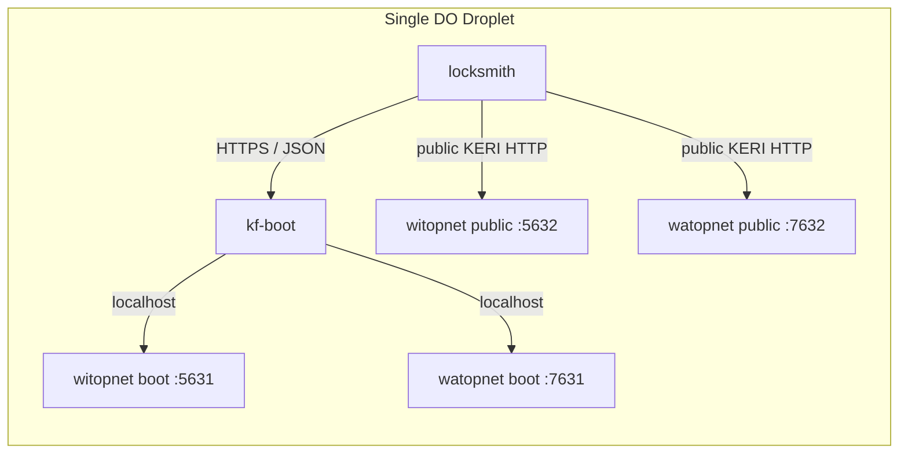

# kf-boot

Minimal KERI Foundation platform service for provisioning witnesses and watchers for
`locksmith`.

This first cut is intentionally small:

- one public-facing service on the same droplet as `witopnet` and `watopnet`
- talks to the existing boot APIs over `127.0.0.1`
- stores platform metadata in a small LMDB baser
- exposes a plain JSON API over normal HTTP/TLS for the conference/demo phase

This service is the front-facing KF boot wrapper around the raw witness and
watcher boot APIs. For now it is still mostly the account-management side of
that service. It does not create or hold the user's long-lived AIDs, and it
does not implement ESSR yet.

## Cut Line

This service should stay a thin control-plane wrapper, not a second KERI app.

What belongs here:

- front-facing JSON routes that `locksmith` can call
- authn/authz for who may manage KF-hosted witnesses and watchers
- public bootstrap discovery for the current demo rules
- create, list, inspect, delete, and watcher status proxy endpoints
- small durable metadata for ownership, display, and routing

What does not belong here:

- local AID or key management
- KERI event signing on behalf of users
- witness authentication or receipt flows
- watcher add/query protocol flows
- OOBI resolution for user identifiers
- long-running orchestration, background agents, or custom protocol state

What still needs to be added next:

- the public onboarding/session flow Sam described for the conference demo
- separate ingress or route grouping for onboarding vs approved-account actions
- IP-based throttling for open signup
- the final `locksmith` plugin contract

## Architecture



What `kf-boot` owns:

- the public-facing KF boot API for the demo
- create, list, inspect, and delete witness records
- create, list, inspect, and delete watcher records
- proxy watcher status from the private boot API
- basic authz based on the authenticated caller id

What `locksmith` still owns:

- ephemeral onboarding UX and account creation flow
- local AIDs and key management
- witness OOBI resolution, auth, and rotations
- watcher OOBI resolution and `/watcher/{eid}/add`

## Why A Small Baser

This service still is not storing KEL state. It is only storing lightweight
platform metadata.

Even so, using a small `LMDBer` + `Komer` baser keeps the service consistent
with the rest of the KF stack and avoids mixing storage styles right at the
boundary between `locksmith`, `keripy`, and the hosted infrastructure.

This is intentionally not the full core `Baser`. It is a tiny custom baser with
two sub-databases:

- resource metadata
- controller bindings

## Auth

This version keeps auth deliberately simple so the service is usable now during
the pre-ESSR conference phase.

- every request must include either:
  - `Authorization: Bearer <caller>`
  - `X-KF-Caller`
- that value is treated as the authenticated caller id
- admins can be configured with `KF_BOOT_ADMIN_PRINCIPALS`
- non-admins may only manage resources where `principal == cid` or an explicit binding exists

This is only the post-onboarding auth hook. It is not the full public signup
flow, and it does not model ephemeral enrollment AIDs. For the conference/demo
phase, the expectation is that a front-door onboarding/session layer resolves to
an authenticated caller id before the request hits the management handlers.
Later, an ESSR edge can verify the sender AID and pass that verified identity
into the same request context without changing the handlers.

## API Contract

### Health

- `GET /health`

Returns `204 No Content`.

### Bootstrap Discovery

- `GET /bootstrap/config`

Returns the current public demo constraints that the plugin should render when
guiding a user through initial account setup.

Example response:

```json
{
  "bootstrap": {
    "account_options": [
      {
        "code": "1-of-1",
        "witness_count": 1,
        "toad": 1
      },
      {
        "code": "3-of-4",
        "witness_count": 4,
        "toad": 3
      }
    ],
    "watcher_required": true,
    "accounts_per_ip": 1,
    "aids_per_ip": 10
  },
  "region": {
    "id": "nyc",
    "name": "New York"
  }
}
```

### Capacity

- `GET /capacity/witopnet`
- `GET /capacity/watopnet`

Example response:

```json
{
  "regions": [
    {
      "id": "nyc",
      "name": "New York"
    }
  ],
  "witopnet": {
    "limit": 20,
    "count": 3
  },
  "available": 17
}
```

### Witnesses

- `GET /witnesses?page=0&page_size=10&filter=foo&order=+name`
- `POST /witnesses`
- `GET /witnesses/{eid}`
- `DELETE /witnesses/{eid}`

`POST /witnesses` accepts a list of documents:

```json
[
  {
    "cid": "EA...controller",
    "name": "wit-nyc-1",
    "identifier_alias": "alice",
    "region_id": "nyc"
  }
]
```

Response:

```json
[
  {
    "eid": "EB...witness",
    "cid": "EA...controller",
    "name": "wit-nyc-1",
    "identifier_alias": "alice",
    "region_id": "nyc",
    "region_name": "New York",
    "oobis": ["https://example.com:5632/oobi/EB.../controller"],
    "url": "https://example.com:5632",
    "public_host": "example.com",
    "public_port": 5632
  }
]
```

### Watchers

- `GET /watchers?page=0&page_size=10&filter=foo&order=+name`
- `POST /watchers`
- `GET /watchers/{eid}`
- `GET /watchers/{eid}/status`
- `DELETE /watchers/{eid}`

`POST /watchers` accepts a single document:

```json
{
  "cid": "EA...controller",
  "name": "wat-nyc-1",
  "identifier_alias": "alice",
  "region_id": "nyc",
  "oobi": "https://example.com:5632/oobi/EA...controller/witness"
}
```

Response:

```json
{
  "eid": "EC...watcher",
  "cid": "EA...controller",
  "name": "wat-nyc-1",
  "identifier_alias": "alice",
  "region_id": "nyc",
  "region_name": "New York",
  "oobis": ["https://example.com:7632/oobi/EC.../controller"],
  "url": "https://example.com:7632",
  "public_host": "example.com",
  "public_port": 7632
}
```

`GET /watchers/{eid}/status` proxies the raw watcher status response from the local
boot API.

## Environment

Required:

- `KF_BOOT_WIT_BOOT_URL`
- `KF_BOOT_WIT_PUBLIC_URL`
- `KF_BOOT_WAT_BOOT_URL`
- `KF_BOOT_WAT_PUBLIC_URL`

Optional:

- `KF_BOOT_HOST` default `127.0.0.1`
- `KF_BOOT_PORT` default `9723`
- `KF_BOOT_DB_PATH` default `./var/kf-boot`
- `KF_BOOT_REGION_ID` default `nyc`
- `KF_BOOT_REGION_NAME` default `New York`
- `KF_BOOT_WITNESS_LIMIT` default `20`
- `KF_BOOT_WATCHER_LIMIT` default `20`
- `KF_BOOT_BOOTSTRAP_ACCOUNT_OPTIONS` default `1-of-1,3-of-4`
- `KF_BOOT_BOOTSTRAP_WATCHER_REQUIRED` default `true`
- `KF_BOOT_BOOTSTRAP_ACCOUNTS_PER_IP` default `1`
- `KF_BOOT_BOOTSTRAP_AIDS_PER_IP` default `10`
- `KF_BOOT_ADMIN_PRINCIPALS` comma-separated list

## Running

Run this in an environment that already has `keri` and `hio` installed. In this
workspace that usually means the shared `keripy` environment.

```bash
KF_BOOT_WIT_BOOT_URL=http://127.0.0.1:5631 \
KF_BOOT_WIT_PUBLIC_URL=https://example.com:5632 \
KF_BOOT_WAT_BOOT_URL=http://127.0.0.1:7631 \
KF_BOOT_WAT_PUBLIC_URL=https://example.com:7632 \
python -m kfboot.cli
```

## Next Step

Before this is ready for the full conference flow:

1. add the public onboarding/session API that the plugin can use with an ephemeral first-contact identity
2. split onboarding ingress from approved-account ingress, even if they still land in the same process
3. put nginx/TLS/rate limiting in front of the service
4. add `locksmith` client calls in the KF plugin
5. add ESSR after the conference demo if we still want the management boundary to be KERI-native
